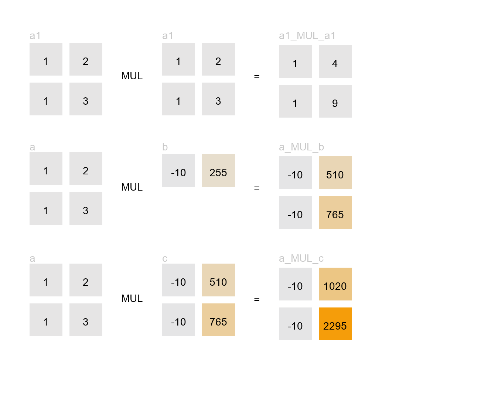

# tinyviz

Graph recorder and visualization helpers for tinygrad tensors.



## Code for the Image
Note the order of execution and the variable names in the image from the code
```python
def add_stuff(a, b):
    c = a * b
    d = a * c
    return d

a1 = Tensor([[1, 2], [1, 3]])
b1 = Tensor([-10, 255])

z = a1 * a1

add_stuff(a1, b1)
```

## Installation

```bash
pip install tinyviz
```

## Usage

```python
from tinygrad import Tensor
from tinyviz import graph

# Record tensor operations
with graph:
    a = Tensor([[1, 2], [3, 4]])
    b = Tensor([[5, 6], [7, 8]])
    c = a + b
    d = c * a

# Display the graph in Jupyter
graph
```

## Features

- **Automatic operation recording**: Tracks tensor operations inside context managers
- **Beautiful visualizations**: Clean, dark-themed graphs with color-coded values
- **Jupyter integration**: Displays directly in notebooks
- **Variable name inference**: Automatically captures tensor names from your code
- **Multiple themes**: Switch between dark and light modes

## API

### Context Manager
```python
with graph:
    result = my_computation()

graph  # Display
```

### Reset
```python
graph.reset()
```

### Decorator
```python
@graph.capture
def my_function(x, y):
    return x + y
```

### Manual Control
```python
graph.start()
result = my_computation()
graph.stop()
graph  # Display
```

### Theme Control
```python
graph.dark()   # Dark theme (default)
graph.light()  # Light theme
```


## License
Apache 2.0
